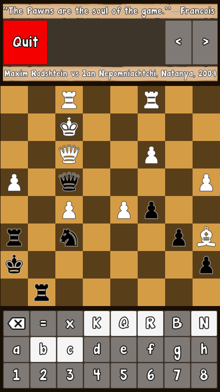

# Blindfold Chess Training

An app to train familiarity with algebraic notation, as a first step to playing chess blindfolded. To be released on Android and iOS, and currently hosted online by Github pages at [jxz12.github.io/ChessNotationDojo](https://jxz12.github.io/ChessNotationDojo).

# Privacy Policy
This app does not collect or store any personal data.